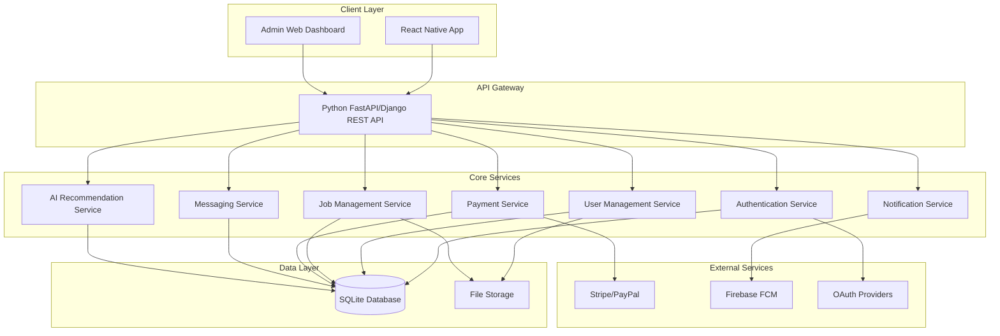
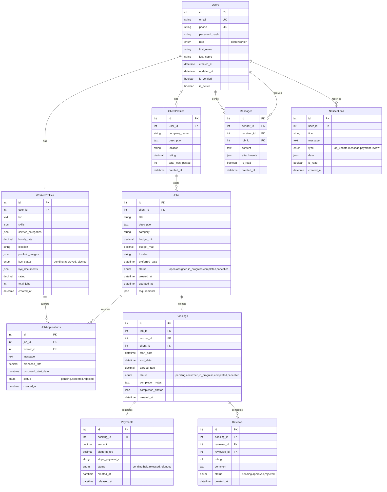

# Design Document

## Overview

The Handwork Marketplace App is a dual-sided marketplace platform built with a Python backend, React Native frontend, and SQLite database. The system connects clients needing manual work services with skilled workers through a comprehensive mobile application with role-based access, secure payments, AI-powered matching, and administrative oversight.

### Tech Stack
- **Backend**: Python (FastAPI/Django)
- **Frontend**: React Native (iOS & Android)
- **Database**: SQLite
- **Payments**: Stripe/PayPal integration
- **Authentication**: OAuth2 (Google, Facebook, Apple) + JWT
- **Real-time**: WebSocket for messaging
- **File Storage**: Local file system with cloud backup option
- **Push Notifications**: Firebase Cloud Messaging (FCM)

## Architecture

### System Architecture



### Database Schema Design



## Components and Interfaces

### Backend API Structure

#### Authentication Module
```python
# auth/models.py
class User(BaseModel):
    id: int
    email: str
    phone: str
    role: UserRole
    is_verified: bool
    
class AuthToken(BaseModel):
    access_token: str
    refresh_token: str
    expires_in: int

# auth/endpoints.py
@router.post("/register")
async def register_user(user_data: UserRegistration) -> AuthResponse

@router.post("/login")
async def login_user(credentials: LoginCredentials) -> AuthResponse

@router.post("/oauth/{provider}")
async def oauth_login(provider: str, token: str) -> AuthResponse
```

#### User Management Module
```python
# users/models.py
class WorkerProfile(BaseModel):
    user_id: int
    bio: str
    skills: List[str]
    service_categories: List[str]
    kyc_status: KYCStatus
    rating: float
    
class ClientProfile(BaseModel):
    user_id: int
    company_name: Optional[str]
    location: str
    rating: float

# users/endpoints.py
@router.get("/profile")
async def get_user_profile(user_id: int) -> UserProfile

@router.put("/profile")
async def update_profile(profile_data: ProfileUpdate) -> UserProfile

@router.post("/kyc/upload")
async def upload_kyc_documents(files: List[UploadFile]) -> KYCResponse
```

#### Job Management Module
```python
# jobs/models.py
class Job(BaseModel):
    id: int
    client_id: int
    title: str
    description: str
    category: str
    budget_range: Tuple[float, float]
    location: str
    status: JobStatus
    
class JobApplication(BaseModel):
    job_id: int
    worker_id: int
    message: str
    proposed_rate: float

# jobs/endpoints.py
@router.post("/jobs")
async def create_job(job_data: JobCreate) -> Job

@router.get("/jobs")
async def list_jobs(filters: JobFilters) -> List[Job]

@router.post("/jobs/{job_id}/apply")
async def apply_to_job(job_id: int, application: JobApplication) -> ApplicationResponse
```

### Frontend Component Structure

#### React Native App Structure
```
src/
├── components/
│   ├── common/
│   │   ├── Button.tsx
│   │   ├── Input.tsx
│   │   ├── Card.tsx
│   │   └── LoadingSpinner.tsx
│   ├── auth/
│   │   ├── LoginForm.tsx
│   │   ├── RegisterForm.tsx
│   │   └── SocialLogin.tsx
│   ├── jobs/
│   │   ├── JobCard.tsx
│   │   ├── JobList.tsx
│   │   ├── JobForm.tsx
│   │   └── JobFilters.tsx
│   ├── profile/
│   │   ├── WorkerProfile.tsx
│   │   ├── ClientProfile.tsx
│   │   └── KYCUpload.tsx
│   └── messaging/
│       ├── ChatList.tsx
│       ├── ChatScreen.tsx
│       └── MessageBubble.tsx
├── screens/
│   ├── auth/
│   ├── jobs/
│   ├── profile/
│   ├── messaging/
│   └── payments/
├── services/
│   ├── api.ts
│   ├── auth.ts
│   ├── storage.ts
│   └── notifications.ts
├── navigation/
│   ├── AppNavigator.tsx
│   ├── AuthNavigator.tsx
│   └── TabNavigator.tsx
└── utils/
    ├── constants.ts
    ├── helpers.ts
    └── validation.ts
```

#### Key React Native Components

```typescript
// components/jobs/JobCard.tsx
interface JobCardProps {
  job: Job;
  onPress: (jobId: number) => void;
  showDistance?: boolean;
}

export const JobCard: React.FC<JobCardProps> = ({ job, onPress, showDistance }) => {
  return (
    <TouchableOpacity onPress={() => onPress(job.id)}>
      <Card>
        <Text style={styles.title}>{job.title}</Text>
        <Text style={styles.category}>{job.category}</Text>
        <Text style={styles.budget}>${job.budget_min} - ${job.budget_max}</Text>
        <Text style={styles.location}>{job.location}</Text>
        {showDistance && <Text style={styles.distance}>{job.distance} miles away</Text>}
      </Card>
    </TouchableOpacity>
  );
};

// services/api.ts
class ApiService {
  private baseURL = 'http://localhost:8000/api';
  
  async login(credentials: LoginCredentials): Promise<AuthResponse> {
    const response = await fetch(`${this.baseURL}/auth/login`, {
      method: 'POST',
      headers: { 'Content-Type': 'application/json' },
      body: JSON.stringify(credentials)
    });
    return response.json();
  }
  
  async getJobs(filters: JobFilters): Promise<Job[]> {
    const queryParams = new URLSearchParams(filters);
    const response = await fetch(`${this.baseURL}/jobs?${queryParams}`);
    return response.json();
  }
}
```

## Data Models

### Core Data Models

```python
# Backend Models (SQLAlchemy/Django ORM)
from enum import Enum
from datetime import datetime
from typing import List, Optional

class UserRole(str, Enum):
    CLIENT = "client"
    WORKER = "worker"

class JobStatus(str, Enum):
    OPEN = "open"
    ASSIGNED = "assigned"
    IN_PROGRESS = "in_progress"
    COMPLETED = "completed"
    CANCELLED = "cancelled"

class KYCStatus(str, Enum):
    PENDING = "pending"
    APPROVED = "approved"
    REJECTED = "rejected"

class User:
    id: int
    email: str
    phone: str
    password_hash: str
    role: UserRole
    first_name: str
    last_name: str
    is_verified: bool
    is_active: bool
    created_at: datetime
    updated_at: datetime

class Job:
    id: int
    client_id: int
    title: str
    description: str
    category: str
    budget_min: float
    budget_max: float
    location: str
    preferred_date: datetime
    status: JobStatus
    requirements: dict
    created_at: datetime
    updated_at: datetime

class Booking:
    id: int
    job_id: int
    worker_id: int
    client_id: int
    start_date: datetime
    end_date: Optional[datetime]
    agreed_rate: float
    status: str
    completion_notes: Optional[str]
    completion_photos: List[str]
    created_at: datetime
```

### Frontend TypeScript Interfaces

```typescript
// types/index.ts
export interface User {
  id: number;
  email: string;
  phone: string;
  role: 'client' | 'worker';
  firstName: string;
  lastName: string;
  isVerified: boolean;
}

export interface Job {
  id: number;
  clientId: number;
  title: string;
  description: string;
  category: string;
  budgetMin: number;
  budgetMax: number;
  location: string;
  preferredDate: string;
  status: JobStatus;
  createdAt: string;
  distance?: number;
}

export interface WorkerProfile {
  userId: number;
  bio: string;
  skills: string[];
  serviceCategories: string[];
  hourlyRate: number;
  location: string;
  portfolioImages: string[];
  kycStatus: 'pending' | 'approved' | 'rejected';
  rating: number;
  totalJobs: number;
}

export interface Message {
  id: number;
  senderId: number;
  receiverId: number;
  jobId: number;
  content: string;
  attachments: string[];
  isRead: boolean;
  createdAt: string;
}
```

## Error Handling

### Backend Error Handling Strategy

```python
# exceptions.py
class AppException(Exception):
    def __init__(self, message: str, status_code: int = 400):
        self.message = message
        self.status_code = status_code

class AuthenticationError(AppException):
    def __init__(self, message: str = "Authentication failed"):
        super().__init__(message, 401)

class ValidationError(AppException):
    def __init__(self, message: str = "Validation failed"):
        super().__init__(message, 422)

class NotFoundError(AppException):
    def __init__(self, message: str = "Resource not found"):
        super().__init__(message, 404)

# middleware.py
@app.exception_handler(AppException)
async def app_exception_handler(request: Request, exc: AppException):
    return JSONResponse(
        status_code=exc.status_code,
        content={
            "error": True,
            "message": exc.message,
            "status_code": exc.status_code
        }
    )
```

### Frontend Error Handling

```typescript
// services/errorHandler.ts
export class ErrorHandler {
  static handle(error: any): string {
    if (error.response?.data?.message) {
      return error.response.data.message;
    }
    
    switch (error.response?.status) {
      case 401:
        return 'Authentication required. Please login again.';
      case 403:
        return 'You do not have permission to perform this action.';
      case 404:
        return 'The requested resource was not found.';
      case 422:
        return 'Please check your input and try again.';
      case 500:
        return 'Server error. Please try again later.';
      default:
        return 'An unexpected error occurred. Please try again.';
    }
  }
  
  static showError(message: string) {
    Alert.alert('Error', message);
  }
}

// hooks/useErrorHandler.ts
export const useErrorHandler = () => {
  const handleError = useCallback((error: any) => {
    const message = ErrorHandler.handle(error);
    ErrorHandler.showError(message);
  }, []);
  
  return { handleError };
};
```

## Testing Strategy

### Backend Testing

```python
# tests/test_auth.py
import pytest
from fastapi.testclient import TestClient
from app.main import app

client = TestClient(app)

class TestAuthentication:
    def test_user_registration(self):
        response = client.post("/api/auth/register", json={
            "email": "test@example.com",
            "password": "password123",
            "role": "client",
            "first_name": "John",
            "last_name": "Doe"
        })
        assert response.status_code == 201
        assert "access_token" in response.json()
    
    def test_user_login(self):
        response = client.post("/api/auth/login", json={
            "email": "test@example.com",
            "password": "password123"
        })
        assert response.status_code == 200
        assert "access_token" in response.json()

# tests/test_jobs.py
class TestJobs:
    def test_create_job(self, authenticated_client):
        response = authenticated_client.post("/api/jobs", json={
            "title": "Plumbing Repair",
            "description": "Fix kitchen sink",
            "category": "plumbing",
            "budget_min": 100,
            "budget_max": 200,
            "location": "New York, NY"
        })
        assert response.status_code == 201
        assert response.json()["title"] == "Plumbing Repair"
```

### Frontend Testing

```typescript
// __tests__/components/JobCard.test.tsx
import React from 'react';
import { render, fireEvent } from '@testing-library/react-native';
import { JobCard } from '../src/components/jobs/JobCard';

describe('JobCard', () => {
  const mockJob = {
    id: 1,
    title: 'Test Job',
    category: 'plumbing',
    budgetMin: 100,
    budgetMax: 200,
    location: 'New York, NY'
  };

  it('renders job information correctly', () => {
    const { getByText } = render(
      <JobCard job={mockJob} onPress={jest.fn()} />
    );
    
    expect(getByText('Test Job')).toBeTruthy();
    expect(getByText('plumbing')).toBeTruthy();
    expect(getByText('$100 - $200')).toBeTruthy();
  });

  it('calls onPress when tapped', () => {
    const onPressMock = jest.fn();
    const { getByText } = render(
      <JobCard job={mockJob} onPress={onPressMock} />
    );
    
    fireEvent.press(getByText('Test Job'));
    expect(onPressMock).toHaveBeenCalledWith(1);
  });
});

// __tests__/services/api.test.ts
import { ApiService } from '../src/services/api';

describe('ApiService', () => {
  it('should login successfully', async () => {
    const mockResponse = { access_token: 'token123' };
    global.fetch = jest.fn().mockResolvedValue({
      json: () => Promise.resolve(mockResponse)
    });

    const result = await ApiService.login({
      email: 'test@example.com',
      password: 'password123'
    });

    expect(result.access_token).toBe('token123');
  });
});
```

### Integration Testing Strategy

1. **API Integration Tests**: Test complete user flows from registration to job completion
2. **Database Integration Tests**: Verify data consistency and relationships
3. **Payment Integration Tests**: Test Stripe/PayPal integration with test accounts
4. **Push Notification Tests**: Verify FCM integration and delivery
5. **End-to-End Tests**: Automated testing of critical user journeys using Detox (React Native)

### Performance Testing

1. **Load Testing**: Test API endpoints under concurrent user load
2. **Database Performance**: Optimize SQLite queries and indexing
3. **Mobile Performance**: Monitor app startup time, memory usage, and battery consumption
4. **Real-time Features**: Test WebSocket performance under high message volume

This design provides a comprehensive foundation for building the Handwork Marketplace App with the specified tech stack, ensuring scalability, maintainability, and robust functionality across all planned features.