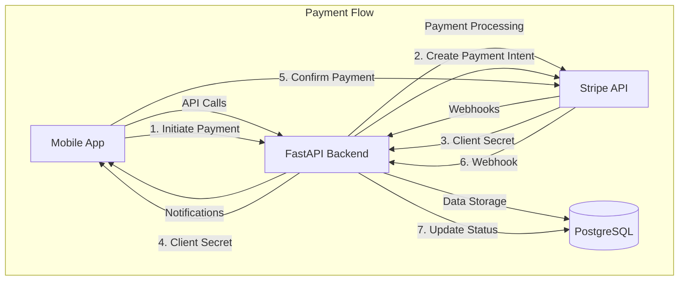

# Design Document: Stripe Payment Integration with Escrow

## Overview

This design document outlines the architecture and implementation details for integrating Stripe payments with escrow functionality into the Handwork Marketplace platform. The system will handle payment processing, escrow management, worker payouts, refunds, and disputes across both backend (FastAPI/Python) and mobile (React Native/Expo) applications.

### Key Features
- Stripe payment processing with Payment Intents API
- Escrow/holding mechanism for client protection
- Automated and manual payment release
- Worker payout management via Stripe Connect
- Payment method management (add, delete, set default)
- Refund processing
- Dispute handling
- Real-time webhook processing
- Mobile-first payment UI with Stripe SDK

## Architecture

### System Components



### Technology Stack

**Backend:**
- FastAPI (Python 3.9+)
- Stripe Python SDK (v5.0+)
- SQLAlchemy ORM
- PostgreSQL database
- Pydantic for data validation

**Mobile:**
- React Native with Expo
- @stripe/stripe-react-native SDK
- Redux Toolkit for state management
- TypeScript for type safety

## Components and Interfaces

### Backend Components

#### 1. Payment Service (`payment_service.py`)

Enhanced service layer handling all payment operations:

```python
class PaymentService:
    def __init__(self, db: Session):
        self.db = db
        self.stripe = stripe
    
    # Core Payment Methods
    async def calculate_job_payment(
        self, 
        working_hours: Decimal, 
        hourly_rate: Decimal
    ) -> Dict[str, Decimal]
    
    async def create_payment_intent(
        self, 
        booking_id: int,
        working_hours: Decimal,
        hourly_rate: Decimal
    ) -> StripePaymentIntentResponse
    
    async def confirm_payment(
        self, 
        payment_intent_id: str,
        booking_id: int
    ) -> Payment
    
    # Escrow Management
    async def hold_payment(self, payment_id: int) -> Payment
    async def release_payment(self, payment_id: int, client_id: int) -> Payment
    async def auto_release_expired_payments(self) -> List[Payment]
    
    # Payment Methods
    async def add_payment_method(
        self, 
        user_id: int,
        payment_method_id: str
    ) -> PaymentMethodModel
    
    async def get_payment_methods(self, user_id: int) -> List[PaymentMethodModel]
    async def set_default_payment_method(self, user_id: int, pm_id: str) -> bool
    async def delete_payment_method(self, user_id: int, pm_id: str) -> bool
    
    # Worker Payouts
    async def request_payout(
        self, 
        worker_id: int,
        amount: Decimal
    ) -> WorkerPayout
    
    async def process_payout(self, payout_id: int) -> WorkerPayout
    
    # Refunds & Disputes
    async def process_refund(
        self, 
        payment_id: int,
        reason: str,
        amount: Optional[Decimal] = None
    ) -> Dict[str, Any]
    
    async def create_dispute(
        self, 
        payment_id: int,
        initiated_by: int,
        reason: str
    ) -> PaymentDispute
```

#### 2. API Endpoints (`endpoints/payments.py`)

RESTful API endpoints for payment operations:

```
POST   /api/v1/payments/calculate          - Calculate payment amount
POST   /api/v1/payments/intent              - Create payment intent
POST   /api/v1/payments/confirm             - Confirm payment
GET    /api/v1/payments                     - List user payments
GET    /api/v1/payments/{id}                - Get payment details
POST   /api/v1/payments/{id}/release        - Release escrowed payment

POST   /api/v1/payments/methods             - Add payment method
GET    /api/v1/payments/methods             - List payment methods
PUT    /api/v1/payments/methods/{id}/default - Set default method
DELETE /api/v1/payments/methods/{id}        - Delete payment method

POST   /api/v1/payments/refund              - Request refund
POST   /api/v1/payments/disputes            - Create dispute
GET    /api/v1/payments/disputes            - List disputes

POST   /api/v1/payments/payouts/request     - Request worker payout
GET    /api/v1/payments/payouts             - List worker payouts
GET    /api/v1/payments/earnings            - Get worker earnings

POST   /api/v1/payments/webhooks/stripe     - Stripe webhook handler
```

#### 3. Webhook Handler

Processes Stripe webhook events:

```python
async def handle_stripe_webhook(request: Request, db: Session):
    # Verify webhook signature
    # Handle events:
    # - payment_intent.succeeded
    # - payment_intent.payment_failed
    # - payment_intent.canceled
    # - charge.refunded
    # - transfer.paid
    # - transfer.failed
```

### Mobile Components

#### 1. Payment Screens

**PaymentScreen.tsx** - Main payment initiation screen
- Display job details (hours, rate, total)
- Show payment breakdown
- Select payment method
- Confirm and process payment

**PaymentMethodsScreen.tsx** - Manage payment methods
- List saved payment methods
- Add new payment method
- Set default method
- Delete methods

**AddPaymentMethodScreen.tsx** - Add new payment method
- Stripe CardField component
- Tokenize card securely
- Save to backend

**PaymentConfirmationScreen.tsx** - Payment success/failure
- Show transaction details
- Display receipt
- Navigation options

**EarningsScreen.tsx** - Worker earnings dashboard
- Total earned
- Available balance
- Pending balance
- Transaction history
- Request payout button

**PayoutRequestScreen.tsx** - Request payout
- Enter amount
- Select payout method
- Confirm request

#### 2. Payment Service (`services/paymentService.ts`)

```typescript
class PaymentService {
  // Payment Calculation
  calculatePayment(
    workingHours: number,
    hourlyRate: number
  ): PaymentBreakdown
  
  // Payment Processing
  createPaymentIntent(
    bookingId: number,
    workingHours: number,
    hourlyRate: number
  ): Promise<PaymentIntent>
  
  confirmPayment(
    paymentIntentId: string,
    paymentMethodId: string
  ): Promise<Payment>
  
  // Payment Methods
  addPaymentMethod(token: string): Promise<PaymentMethod>
  getPaymentMethods(): Promise<PaymentMethod[]>
  setDefaultPaymentMethod(id: string): Promise<void>
  deletePaymentMethod(id: string): Promise<void>
  
  // Worker Operations
  getEarnings(): Promise<WorkerEarnings>
  requestPayout(amount: number): Promise<Payout>
  
  // Refunds & Disputes
  requestRefund(paymentId: number, reason: string): Promise<Refund>
  createDispute(paymentId: number, reason: string): Promise<Dispute>
}
```

#### 3. Redux State Management

```typescript
// Payment Slice
interface PaymentState {
  currentPayment: Payment | null
  paymentMethods: PaymentMethod[]
  earnings: WorkerEarnings | null
  payouts: Payout[]
  loading: boolean
  error: string | null
}

// Actions
- fetchPaymentMethods
- addPaymentMethod
- deletePaymentMethod
- setDefaultPaymentMethod
- createPaymentIntent
- confirmPayment
- releasePayment
- fetchEarnings
- requestPayout
```

## Data Models

### Database Schema

#### Payment Table
```sql
CREATE TABLE payments (
    id SERIAL PRIMARY KEY,
    booking_id INTEGER REFERENCES bookings(id),
    stripe_payment_intent_id VARCHAR(255) UNIQUE,
    amount NUMERIC(10, 2) NOT NULL,
    platform_fee NUMERIC(10, 2) NOT NULL,
    worker_amount NUMERIC(10, 2) NOT NULL,
    currency VARCHAR(3) DEFAULT 'usd',
    status VARCHAR(50) NOT NULL, -- pending, held, released, refunded, failed
    payment_method VARCHAR(50), -- stripe, paypal
    working_hours NUMERIC(10, 2),
    hourly_rate NUMERIC(10, 2),
    refund_reason TEXT,
    created_at TIMESTAMP DEFAULT NOW(),
    updated_at TIMESTAMP,
    released_at TIMESTAMP,
    INDEX idx_booking_id (booking_id),
    INDEX idx_status (status),
    INDEX idx_created_at (created_at)
);
```

#### Payment Methods Table
```sql
CREATE TABLE payment_methods (
    id SERIAL PRIMARY KEY,
    user_id INTEGER REFERENCES users(id),
    stripe_payment_method_id VARCHAR(255) UNIQUE,
    type VARCHAR(50), -- card, bank_account
    brand VARCHAR(50), -- visa, mastercard, etc.
    last4 VARCHAR(4),
    expiry_month INTEGER,
    expiry_year INTEGER,
    is_default BOOLEAN DEFAULT FALSE,
    created_at TIMESTAMP DEFAULT NOW(),
    INDEX idx_user_id (user_id)
);
```

#### Worker Payouts Table
```sql
CREATE TABLE worker_payouts (
    id SERIAL PRIMARY KEY,
    worker_id INTEGER REFERENCES worker_profiles(id),
    amount NUMERIC(10, 2) NOT NULL,
    stripe_transfer_id VARCHAR(255),
    status VARCHAR(50), -- pending, processing, completed, failed
    requested_at TIMESTAMP DEFAULT NOW(),
    processed_at TIMESTAMP,
    failure_reason TEXT,
    INDEX idx_worker_id (worker_id),
    INDEX idx_status (status)
);
```

### TypeScript Interfaces

```typescript
interface PaymentBreakdown {
  workingHours: number
  hourlyRate: number
  subtotal: number
  platformFee: number
  platformFeePercentage: number
  total: number
  currency: string
}

interface Payment {
  id: number
  bookingId: number
  amount: number
  platformFee: number
  workerAmount: number
  status: 'pending' | 'held' | 'released' | 'refunded' | 'failed'
  paymentMethod: 'stripe' | 'paypal'
  workingHours: number
  hourlyRate: number
  createdAt: string
  releasedAt?: string
}

interface PaymentMethod {
  id: string
  type: 'card' | 'bank_account'
  brand?: string
  last4: string
  expiryMonth?: number
  expiryYear?: number
  isDefault: boolean
}

interface WorkerEarnings {
  totalEarned: number
  availableBalance: number
  pendingBalance: number
  totalWithdrawn: number
  platformFeesPaid: number
}

interface Payout {
  id: number
  amount: number
  status: 'pending' | 'processing' | 'completed' | 'failed'
  requestedAt: string
  processedAt?: string
  failureReason?: string
}
```

## Error Handling

### Backend Error Responses

```python
class PaymentError(HTTPException):
    """Base payment error"""
    pass

class InsufficientFundsError(PaymentError):
    """Raised when payment fails due to insufficient funds"""
    status_code = 400
    detail = "Insufficient funds"

class PaymentAlreadyReleasedError(PaymentError):
    """Raised when attempting to release already released payment"""
    status_code = 400
    detail = "Payment already released"

class InvalidPaymentMethodError(PaymentError):
    """Raised when payment method is invalid"""
    status_code = 400
    detail = "Invalid payment method"
```

### Mobile Error Handling

```typescript
enum PaymentErrorCode {
  INSUFFICIENT_FUNDS = 'insufficient_funds',
  CARD_DECLINED = 'card_declined',
  NETWORK_ERROR = 'network_error',
  INVALID_AMOUNT = 'invalid_amount',
  PAYMENT_ALREADY_RELEASED = 'payment_already_released',
}

function handlePaymentError(error: any): string {
  // Map error codes to user-friendly messages
  // Show appropriate UI feedback
  // Log errors for debugging
}
```

## Testing Strategy

### Backend Tests

1. **Unit Tests** (`test_payment_service.py`)
   - Test payment calculation logic
   - Test platform fee calculation
   - Test payment intent creation
   - Test escrow hold/release logic
   - Test payout calculations

2. **Integration Tests** (`test_payment_endpoints.py`)
   - Test complete payment flow
   - Test webhook processing
   - Test refund processing
   - Test dispute creation

3. **Stripe Test Mode**
   - Use Stripe test API keys
   - Test with Stripe test cards
   - Verify webhook handling

### Mobile Tests

1. **Component Tests**
   - Test payment screen rendering
   - Test payment method selection
   - Test form validation
   - Test error display

2. **Integration Tests**
   - Test payment flow end-to-end
   - Test payment method management
   - Test earnings display

3. **E2E Tests**
   - Complete payment journey
   - Add/remove payment methods
   - Request payout flow

## Security Considerations

1. **PCI Compliance**
   - Never store raw card details
   - Use Stripe tokenization
   - Implement Stripe Elements/CardField

2. **API Security**
   - Require authentication for all payment endpoints
   - Validate user permissions (client vs worker)
   - Implement rate limiting
   - Verify webhook signatures

3. **Data Protection**
   - Encrypt sensitive data at rest
   - Use HTTPS for all communications
   - Implement audit logging
   - Regular security audits

## Configuration

### Environment Variables

**Backend (.env)**
```
STRIPE_SECRET_KEY=sk_test_...
STRIPE_PUBLISHABLE_KEY=pk_test_...
STRIPE_WEBHOOK_SECRET=whsec_...
PLATFORM_FEE_PERCENTAGE=10
AUTO_RELEASE_DAYS=14
```

**Mobile (.env)**
```
EXPO_PUBLIC_STRIPE_PUBLISHABLE_KEY=pk_test_...
EXPO_PUBLIC_API_URL=https://api.handwork.com
```

## Deployment Considerations

1. **Stripe Account Setup**
   - Create Stripe account
   - Enable Payment Intents API
   - Set up Stripe Connect for worker payouts
   - Configure webhooks

2. **Database Migrations**
   - Add payment_methods table
   - Add working_hours and hourly_rate to payments table
   - Add indexes for performance

3. **Monitoring**
   - Set up Stripe dashboard monitoring
   - Implement payment failure alerts
   - Track escrow release metrics
   - Monitor payout processing

4. **Gradual Rollout**
   - Test in staging environment
   - Beta test with select users
   - Monitor error rates
   - Full production release
